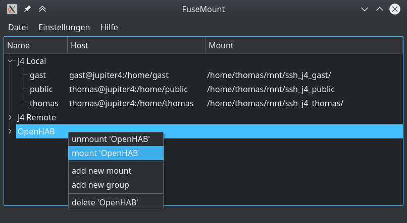

# FuseMount

This is a GUI frontend for sshfs.
Personally I use sshfs a lot to connect to remote servers to work on them.
With this GUI frontend it is more comfortable to (dis-)connect mounts.
This program requires KDE framework.

### Features

* mount/unmount sshfs
* group mounts
* store passwords in kde wallet

# Screeshot



# Build

```bash
$> cd build/ && cmake .. && make
$> sudo make install
```
